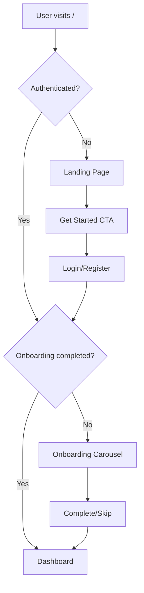

# Landing Page & Onboarding for Odin Wallet

## Overview

Create a public landing page to introduce Odin Wallet to new visitors, and an onboarding carousel that guides first-time users through the app's key features after signup/login.




## 1. Backend Changes

**Add onboarding tracking to user model:**

- [`pkg/database/sqlite.go`](pkg/database/sqlite.go): Add migration for `onboarding_completed` boolean column (default false)
- [`internal/models/user.go`](internal/models/user.go): Add `OnboardingCompleted bool` field
- [`internal/handlers/user.go`](internal/handlers/user.go): Update `GetCurrentUser` to return the field, add `CompleteOnboarding` endpoint

**New API endpoint:**

- `POST /api/user/complete-onboarding` - marks onboarding as done

## 2. Frontend: Landing Page

**New file:** `frontend/src/pages/Landing.tsx`Minimal design with:

- Hero section: "Odin Wallet" branding + tagline about personal finance tracking
- Value props (3 brief points with icons): Track accounts, Manage spending, See reports
- Single CTA button: "Get Started" linking to `/register`
- Secondary link: "Already have an account? Login"

**Design notes:**

- Dark theme matching app (bg-tertiary, primary accent)
- Mobile-first responsive layout
- Subtle gradient or pattern background for visual interest

## 3. Frontend: Onboarding Carousel

**New file:** `frontend/src/components/onboarding/OnboardingCarousel.tsx`4-5 swipeable slides:

1. **Welcome** - "Welcome to Odin Wallet" + brief intro
2. **Accounts** - Track multiple accounts (checking, savings, credit cards)
3. **Transactions** - Log expenses and categorize spending
4. **Reports** - Visualize where your money goes
5. **Budgets** - Set spending limits per category

**Features:**

- Swipe gestures (using framer-motion drag)
- Dot indicators showing progress
- Skip button (top-right)
- "Next" / "Get Started" button at bottom

**New file:** `frontend/src/pages/Onboarding.tsx` - wrapper page that shows carousel and handles completion

## 4. Routing Updates

**Update:** [`frontend/src/App.tsx`](frontend/src/App.tsx)

- Add `/welcome` route for Landing page (public, redirects to dashboard if logged in)
- Add `/onboarding` route (protected, redirects if already completed)
- Modify `ProtectedRoute` to check `onboarding_completed` and redirect to `/onboarding` if false

## 5. Type & API Updates

- [`frontend/src/types/index.ts`](frontend/src/types/index.ts): Add `onboarding_completed` to `User` interface
- [`frontend/src/api/client.ts`](frontend/src/api/client.ts): Add `completeOnboarding()` method

## File Structure

```javascript
frontend/src/
├── pages/
│   ├── Landing.tsx (new)
│   └── Onboarding.tsx (new)
├── components/
│   └── onboarding/
│       └── OnboardingCarousel.tsx (new)
```


## Visual Style

- Match existing dark theme (`bg-tertiary`, `text-quaternary`, `primary` accents)
- Abstract/friendly illustrations using Lucide icons composed creatively