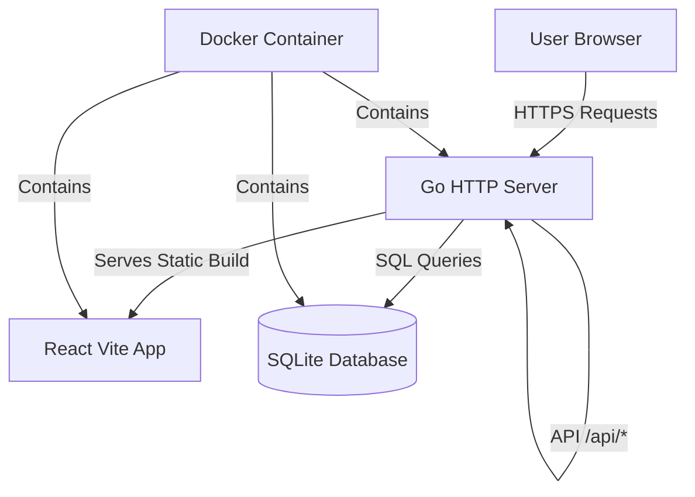

# Odin Wallet - Full-Stack Personal Finance Application

## Architecture Overview



**Tech Stack:**

- Backend: Go (Gorilla Mux/Chi router, SQLite driver)
- Frontend: React 18 + Vite + TailwindCSS
- Database: SQLite
- Auth: Session-based with secure cookies
- Deployment: Single Docker image via GitHub Actions

---

## Phase 1: Project Foundation

### 1.1 Go Backend Setup

- Initialize Go module with clean architecture structure:
- `cmd/server/` - main application
- `internal/handlers/` - HTTP handlers
- `internal/models/` - database models
- `internal/middleware/` - auth middleware
- `internal/services/` - business logic
- `pkg/database/` - SQLite connection
- Set up Chi/Gorilla router with session middleware
- Configure static file serving for React build

### 1.2 React Frontend Setup

- Initialize Vite + React + TypeScript project in `frontend/`
- Configure TailwindCSS with Odin brand colors:
- Primary: `#DDE61F` (Golden Glow)
- Secondary: `#1A5632` (Nordic Pine)
- Tertiary: `#0F1822` (Digital Slate)
- Quaternary: `#D6D7D5` (Nordic Mist)
- Card: `#1a2332`
- Border: `#2a3544`
- Set up mobile-first responsive breakpoints
- Configure build output to `dist/` for Go to embed

### 1.3 Database Schema

**Tables:**

```sql
users (id, email, password_hash, created_at)
sessions (id, user_id, expires_at, created_at)
accounts (
  id, user_id, name, type, color, currency,
  -- Common fields
  current_balance,
  -- Credit card specific
  credit_limit, credit_owed, closing_date,
  -- Loan specific
  loan_initial_amount, loan_current_owed, monthly_payment,
  -- Savings/Investment specific
  yearly_interest_rate,
  created_at, updated_at
)
transactions (
  id, account_id, type, amount, description,
  category, balance_after, created_at
)
```

**Account types:** `cash`, `debit`, `credit_card`, `loan`, `saving`, `investment`**Transaction types per account:**| Account Type | Transaction Types | Balance Effect ||--------------|-------------------|----------------|| Cash/Debit | `deposit`, `withdrawal` | +/- current_balance || Credit Card | `expense`, `payment` | expense: +credit_owed, payment: -credit_owed || Loan | `payment` | -loan_current_owed || Saving/Investment | `deposit`, `withdrawal` | +/- current_balance |Note: Credit card `credit_owed` displays as positive but counts as liability in overview calculations.**Transaction Categories (predefined):**

- `groceries` - Food & groceries
- `dining` - Restaurants & takeout
- `transport` - Gas, public transit, rideshare
- `utilities` - Electric, water, internet, phone
- `rent` - Rent & housing
- `healthcare` - Medical, pharmacy, insurance
- `entertainment` - Movies, concerts, streaming
- `shopping` - Clothing, electronics, general retail
- `subscriptions` - Recurring services (Netflix, Spotify, etc.)
- `games` - Video games, in-app purchases
- `travel` - Flights, hotels, vacation
- `education` - Courses, books, tuition
- `fitness` - Gym, sports, wellness
- `personal` - Haircuts, beauty, self-care
- `gifts` - Presents, donations
- `income` - Salary, freelance, transfers in
- `transfer` - Moving money between accounts
- `other` - Uncategorized

---

## Phase 2: Authentication System

### 2.1 Backend Auth

- Password hashing with bcrypt
- Session management (gorilla/sessions or custom SQLite-based)
- Middleware to protect routes
- Endpoints:
- `POST /api/auth/register`
- `POST /api/auth/login`
- `POST /api/auth/logout`
- `GET /api/auth/me`

### 2.2 Frontend Auth

- Login page with minimalist form design
- Registration page
- Protected route wrapper component
- Auth context for user state management
- Smooth transitions and micro-interactions

---

## Phase 3: Account Management

### 3.1 Backend Account API

- `GET /api/accounts` - list all user accounts
- `POST /api/accounts` - create account (type-specific validation)
- `GET /api/accounts/:id` - get account details
- `PUT /api/accounts/:id` - update account
- `DELETE /api/accounts/:id` - delete account
- `GET /api/overview` - financial summary (assets vs liabilities)

**Business logic per account type:**

- **Cash/Debit**: Simple balance tracking
- **Credit Card**: Calculate utilization % (owed/limit), days until closing
- **Loan**: Track total paid (initial - current), payment progress
- **Saving/Investment**: Calculate projected growth

### 3.2 Frontend Account Views

**Dashboard:**

- Hero section: Total assets vs total liabilities with animated numbers
- Visual breakdown (assets on left, liabilities on right)
- Account cards grid with distinctive colors and type icons
- Floating action button for "Add Account"

**Account Creation Form:**

- Step 1: Choose type (visual cards with icons)
- Step 2: Basic info (name, color picker, currency selector)
- Step 3: Type-specific fields:
- Debit: Initial balance
- Credit: Owed, limit, closing date (date picker)
- Loan: Initial amount, current owed, monthly payment
- Saving/Investment: Current amount, interest rate
- Smooth transitions between steps

**Account Detail View:**

- Type-specific card design:
- **Credit Card**: Minimalist credit card mockup showing utilization bar, owed/limit, closing date countdown
- **Loan**: Progress bar (initial → current), monthly payment highlight
- **Saving/Investment**: Amount with interest rate badge, projected growth sparkline

---

## Phase 4: Transaction System

### 4.1 Backend Transaction API

- `POST /api/accounts/:id/transactions` - create transaction
- `GET /api/accounts/:id/transactions` - list transactions (paginated)
- `GET /api/transactions/recent` - recent transactions across all accounts

**Transaction validation and balance updates:**

- **Cash/Debit**:
- `deposit`: Adds to `current_balance`
- `withdrawal`: Subtracts from `current_balance` (validate sufficient funds optional)
- **Credit Card**:
- `expense`: Increases `credit_owed` (validate against `credit_limit`)
- `payment`: Decreases `credit_owed`
- **Loan**:
- `payment`: Decreases `loan_current_owed`
- **Saving/Investment**:
- `deposit`: Adds to `current_balance`
- `withdrawal`: Subtracts from `current_balance`

Each transaction stores `balance_after` for history accuracy.

### 4.2 Frontend Transaction UI

**Add Transaction (per account type):**

- Floating action button on account detail page
- Bottom sheet/modal with type-specific options:
- Cash/Debit/Saving/Investment: Toggle between Deposit/Withdrawal
- Credit Card: Toggle between Expense/Payment
- Loan: Single "Make Payment" action
- Amount input with currency symbol
- Category selector (icon grid or dropdown with category icons)
- Optional description field
- Instant balance preview showing new balance after transaction

**Transaction History:**

- Chronological list on account detail page
- Color-coded by type (green for deposits/payments, red for withdrawals/expenses)
- Each entry shows: category icon, description, amount, running balance, date
- Filter by category option
- Pull-to-refresh and infinite scroll for mobile

**Dashboard Integration:**

- Recent transactions widget showing last 5-10 across all accounts
- Quick-add transaction shortcut from dashboard

---

## Phase 5: Design Excellence

### 5.1 Visual Details

- Custom fonts (Inter or Geist for modern minimalism)
- Smooth page transitions (Framer Motion)
- Micro-interactions:
- Button hover states with subtle scale/shadow
- Card hover lift effects
- Number animations (react-countup)
- Loading skeletons
- Glass-morphism effects for cards (subtle backdrop blur)
- Custom color picker with Odin palette + user colors
- Responsive typography scale

### 5.2 Mobile-First UX

- Touch-optimized button sizes (min 44px)
- Swipe gestures for account cards
- Bottom navigation for mobile
- Responsive grid (1 col mobile, 2-3 cols tablet/desktop)
- Safe area padding for iOS webview compatibility

---

## Phase 6: Docker & CI/CD

### 6.1 Dockerfile

```dockerfile
# Multi-stage build
# Stage 1: Build React frontend
FROM node:20-alpine AS frontend
WORKDIR /app/frontend
COPY frontend/package*.json ./
RUN npm ci
COPY frontend/ ./
RUN npm run build

# Stage 2: Build Go backend
FROM golang:1.21-alpine AS backend
WORKDIR /app
COPY go.mod go.sum ./
RUN go mod download
COPY . .
COPY --from=frontend /app/frontend/dist ./frontend/dist
RUN go build -o server cmd/server/main.go

# Stage 3: Production image
FROM alpine:latest
WORKDIR /app
COPY --from=backend /app/server .
COPY --from=backend /app/frontend/dist ./frontend/dist
EXPOSE 8080
CMD ["./server"]
```


### 6.2 GitHub Actions

**Workflow** (`.github/workflows/docker.yml`):

- Trigger on push to `main`
- Build Docker image
- Tag with commit SHA and `latest`
- Push to Docker Hub / GitHub Container Registry
- User pulls and runs: `docker run -p 8080:8080 -v ./data:/app/data odin/wallet:latest`

### 6.3 Configuration

- Environment variables for production (port, session secret, DB path)
- Volume mount for SQLite database persistence (`/app/data`)
- Health check endpoint (`/health`)

---

## File Structure

```javascript
wallet/
├── cmd/
│   └── server/
│       └── main.go
├── internal/
│   ├── handlers/
│   │   ├── auth.go
│   │   ├── accounts.go
│   │   └── transactions.go
│   ├── middleware/
│   │   └── auth.go
│   ├── models/
│   │   ├── user.go
│   │   ├── session.go
│   │   ├── account.go
│   │   └── transaction.go
│   └── services/
│       ├── account_service.go
│       └── transaction_service.go
├── pkg/
│   └── database/
│       └── sqlite.go
├── frontend/
│   ├── src/
│   │   ├── components/
│   │   ├── pages/
│   │   ├── contexts/
│   │   └── App.tsx
│   ├── package.json
│   └── vite.config.ts
├── Dockerfile
├── .github/
│   └── workflows/
│       └── docker.yml
├── go.mod
└── README.md
```

---

## README Documentation

The README.md will include:

### Development Setup

```bash
# Prerequisites
- Go 1.21+
- Node.js 20+
- npm or pnpm

# Clone and setup
git clone https://github.com/odin/wallet.git
cd wallet

# Start backend (from root)
go mod download
go run cmd/server/main.go

# Start frontend (separate terminal)
cd frontend
npm install
npm run dev
```

Backend runs on `http://localhost:8080`, frontend dev server on `http://localhost:5173` (proxies API to backend).

### Production (Docker)

```bash
# Pull latest image
docker pull ghcr.io/odin/wallet:latest

# Run with persistent data
docker run -d \
  --name odin-wallet \
  -p 8080:8080 \
  -v $(pwd)/wallet-data:/app/data \
  -e SESSION_SECRET=your-secure-secret-here \
  ghcr.io/odin/wallet:latest

# Access at http://localhost:8080
```


### Environment Variables

| Variable | Description | Default ||----------|-------------|---------|| `PORT` | Server port | `8080` || `SESSION_SECRET` | Secret for session cookies (required in prod) | random || `DB_PATH` | SQLite database path | `./data/wallet.db` |

### Build from Source

```bash
# Build frontend
cd frontend && npm run build && cd ..

# Build Go binary
go build -o wallet-server cmd/server/main.go

# Run
./wallet-server
```

---

## Key Implementation Notes

1. **Currency Support**: Store currency code (USD, EUR, etc.) per account; convert for overview using static rates initially
2. **Account Colors**: Predefined palette + hex input; validate and sanitize
3. **Financial Overview Logic**:

- Assets: Cash + Debit + Saving + Investment balances
- Liabilities: Credit card owed + Loan current owed

4. **Session Security**: HTTPOnly cookies, CSRF protection, secure flag in production
5. **Mobile Webview Ready**: No external dependencies, all assets embedded, CORS configured